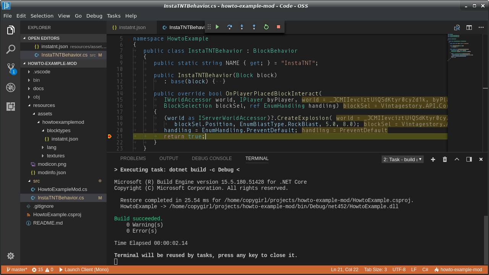
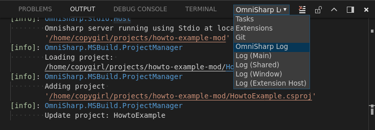
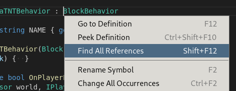

# How to set up Vintage Story modding with VS Code and .NET Core tools

This repository will attempt to explain and demonstrate how to set up a
modding enviroment for the creation of mods for the block-based sandbox game
[Vintage Story][VS] using the [.NET Core SDK][dotnet] and [Visual Studio Code][vscode].



This how-to was last updated for Vintage Story version 1.8.0 but will
hopefully continue working in the future.

## Why .NET Core?

Vintage Story is built against .NET 4.5.2 and runs using Mono on platforms
other than Windows, so why are we using .NET Core?

- It's **cross-platform**. We don't need to change our tooling or commands to
  work on different platforms. I've moved from Windows to Linux while working
  on Vintage Story mods here and there and only needed to make minor changes
  to also make it work on another platform.
- It's **convenient**. As .NET Core comes with commands to manipulate, create
  and build solution and project files, we don't need to rely on IDEs. The
  newer `.csproj` file format doesn't require referencing every single `.cs`
  file, either.

## Why Visual Studio Code?

Despite what its name might imply, this has nothing to do with the overblown
IDE that is Visual Studio. It's a relatively light-weight, cross-platform
code editor that comes with syntax highlighting, code completion, source
control integration, debugging tools, ...

Essentially you get all the IDE features you're used without any of the
bloat, in a modern look.

## Prerequisites

- Get the [game][VS].
- Install the [.NET Core SDK][dotnet-dl].
- Install [Visual Studio Code][vscode-dl].
- Install the [C# extension][cs-ext] from the "Extensions" tab in VS Code.
- If you run on Mono, install the [Mono Debug][mono-ext] extension.

If you're on Arch Linux like me, you can get the game using the [AUR][AUR]
package [`vintagestory`][VS-AUR] (created by me), and the .NET Core SDK and
VS Code by installing the official packages `dotnet-sdk` and `code`.

### Environment Variables

I also recommend setting up two environmental variables:

- `VINTAGE_STORY`, which points to the where the game is installed.
- `VINTAGE_STORY_DATA`, pointing to the user data directory.  
  This is where world files go and also where we'll put our mods.

Here are the relevant lines from my `~/.xprofile`:

```sh
export VINTAGE_STORY=/usr/share/vintagestory
export VINTAGE_STORY_DATA=$HOME/.config/VintagestoryData
```

This will just make things more consistent across different platforms and
setups, and it's what I will use in this repository and how-to, but it's not
required. However, if you decide to leave this out, do make sure to update
any occurances in the `.csproj` and `launch.json` with absolute paths.

## Project Setup

Now that we're done with that, it's time to set up the project structure.
Create and open a new folder in VS Code!

### Directory Structure

- `./`: The root folder is mainly where our `.csproj` file will reside, but
  other files are going to end up here, such as `.gitignore` if you're using
  Git, the readme, license, ...
- `./src/`: Contains all source (`.cs`) files for our mod. This is what
  makes this a code mod over a simple content mod, which just contains
  assets. More on this destinction on the [official wiki][VS-wiki].
- `./resources/`: This directory contains all files which will eventually
  be included in the release `.zip` file such as the `modinfo.json`.
- `./resources/assets/`: Contains all assets for our mod. Unlike some other
  games (*cough* Minecraft *cough*), a lot of the heavy lifting will
  already be done by the asset loading portion of the engine.

### Project File

Create a `.csproj` file for our project along these lines:

```xml
<Project Sdk="Microsoft.NET.Sdk">
  <PropertyGroup>
    <TargetFramework>net452</TargetFramework>
  </PropertyGroup>
  
  <ItemGroup>
    <Reference Include="VintagestoryAPI">
      <HintPath>$(VINTAGE_STORY)/VintagestoryAPI.dll</HintPath>
    </Reference>
  </ItemGroup>
  
  <Target Name="Copy" AfterTargets="PostBuildEvent" Condition="'$(Configuration)' == 'Debug'">
    <Copy SourceFiles="$(TargetPath)" DestinationFolder="$(VINTAGE_STORY_DATA)/Mods" />
    <Copy SourceFiles="$(TargetDir)/$(TargetName).pdb" DestinationFolder="$(VINTAGE_STORY_DATA)/Mods" />
  </Target>
</Project>
```

As seen in my [TestMod's project file][testmod-csproj], there are more fields
you can add for the sake of completion, but these are not required.

You can also see us adding a reference to the modding API `.dll`. If you need
to reference base game content in your mod you may also want to include
`$(VINTAGE_STORY)/Mods/VSEssentials.dll` and `VSSurvivalMod.dll`.

Lastly, we're setting up a post-build task to copy our mod's resulting `.dll`
and `.pdb`, which contains information for the debugger, into the user data's
`Mods` directory. Though, we only want to do this when we're creating a debug
build.

### General VS Code suggestions and Cheat Sheet

At this point you have everything set up to start writing some code, so here
are some basic things to get you set up.

First of all, one of the issues you might encounter is code completion not
working properly. This is likely because you have created the project after
the C# extension has started up. To fix that, press `F1` to open the
**Command Palette** and enter "Reload Window".

This time OmniSharp should recognize the project, and you can open the
"Output" window to verify this. There's a lot of ways to get to it, including
the command palette (search for "Toggle Output" this time), just make sure
you have "OmniSharp Log" selected in the dropdown:



Next up, if you already know the type names you want to use, but not which
namespace they're residing in, or you don't want to bother manually importing
them, simply write the type name and pay attention to the **Quick Fix** bulb
to the left, which you can either click or press `Ctrl+.`to get to:


Also, on a right click you have the option of **Go to Definiton** (`F12`) and
**Rename Symbol** (`F2`) which are two other things I end up using a lot. The
former can also be used to see which methods are available on an API type to
which you don't have source access to.



### Working with multiple Mods

You can also set up a workspace that includes multiple different mods and
have a single build task to compile all sub-projects and launcher to start
the game with all mods loaded.

Feel free to take inspiration from my [VintageStoryMods][VSMods-github]
repository until I've updated this section to include more information.

**TODO:** Expand on this and explain `dotnet` CLI commands for manipulating
          solution files (`.sln`).

## Tasks and Launchers

After you've gotten familiar with some resources on how to create your mod,
either from looking at the [Vintage Story Wiki][VS-wiki] or taking
inspiration from other open source mods, it is time to actually build and
launch it in the game.

For this we need two things: First, a `.vscode/tasks.json` file, in which
we'll define a build task to compile our mod into a handy `.dll` file. The
compilation step **can** be done by the game itself, which is explained on
the wiki, but you lose out on the possibility of debbugging your code.

```json
{
  "version": "2.0.0",
  "tasks": [{
    "label": "build (Debug)",
    "group": { "kind": "build", "isDefault": true },
    "presentation": { "reveal": "silent" },
    "problemMatcher": "$msCompile",
    
    "type": "shell",
    "command": "dotnet",
    "linux": { "options": { "env": { "FrameworkPathOverride": "/lib/mono/4.5.2-api/" } } },
    "args": [ "build", "-c", "Debug" ]
  }]
}
```

The default `build` task can be run by pressing `Ctrl+Shift+B`. Other tasks
may be run by pressing `F1`, typing `task` and selecting "Run Task" option,
which may be useful if you configure any custom tasks, such as ones to create
a release `.zip` file.

As you can see there is a platform specific option, which sets the
environment variable `FrameworkPathOverride`. This might not be needed in
your linux environment, or might need to be changed to point to where your
Mono installation's .NET 4.5.2 reference assemblies are located.

If you run the `build (Debug)` task and start the game afterwards, you may be
able to see that the mod is actually appearing in the Mod Manager in-game
already, assuming everything went according to plan. Unfortunately, you'll
find that none of your custom assets have been loaded in the game.

To make this work, you'll either have to create a `.zip` file for the game to
load (more on this later) or you tell the game to load from your mod's
existing `assets` directory. For this, we'll create a **launcher**. The
upside of this approach is that we can also hook a debugger into the game,
allowing us to use breakpoints and debug exceptions originating from our
code.

```json
{
  "version": "0.2.0",
  "configurations": [{
    "name": "Launch Client",
    "type": "mono",
    "request": "launch",
    "preLaunchTask": "build (Debug)",
    "program": "${env:VINTAGE_STORY}/Vintagestory.exe",
    "args": [
      "-p3", "--openWorld", "modding test world.vcdbs",
      "--addOrigin", "${workspaceFolder}/resources/assets"
    ],
    "console": "internalConsole",
    "internalConsoleOptions": "openOnSessionStart",
  }]
}
```

Note that if you're using **.NET on Windows**, you need to replace `type`
with `"clr"`. In this project's [launch.json](.vscode/launch.json) you'll
find that I've created two launchers: One for .NET, and one for Mono. You may
choose to do this as well to ensure your project can be run from multiple
plaforms.

These are the arguments we're passing to the game:

- `-p3`: The world preset, if it doesn't exist yet.
  `1` = normal / survival. `3` = superflat / creative.
- `--openWorld <name>`: Open or create a world with the specified name.
- `--addOrigin <directory> [...]`: Load assets from the these directories.

You should now be able to run the game in debug mode with your mod by simply
selecting the appropriate launcher by pressing on "Launch Client" to the
left of the bottom status bar in VS Code. When you've done this once, you can
also run the last used launcher by pressing `F5`.

## Release

To create a release `.zip` of your mod, simply package the `.dll` file from
`bin/Release` as well as the contents of the `resources` directory.
Optionally you may include the `.pdb` file, which contains debug symbols not
necessary to run the mod, but can be useful, as it allows exceptions to
display the exact line number at which it occured in your code.

**TODO:** Include a task to do this automatically.


[VS]: https://www.vintagestory.at/
[VS-wiki]: http://wiki.vintagestory.at/
[VS-AUR]: https://aur.archlinux.org/packages/vintagestory
[dotnet]: https://dotnet.microsoft.com/
[dotnet-dl]: https://dotnet.microsoft.com/download
[vscode]: https://code.visualstudio.com/
[vscode-dl]: https://code.visualstudio.com/Download
[cs-ext]: https://marketplace.visualstudio.com/items?itemName=ms-vscode.csharp
[mono-ext]: https://marketplace.visualstudio.com/items?itemName=ms-vscode.mono-debug
[AUR]: https://wiki.archlinux.org/index.php/Arch_User_Repository
[testmod-csproj]: https://github.com/copygirl/TestMod/blob/master/TestMod.csproj
[VSMods-github]: https://github.com/copygirl/VintageStoryMods
